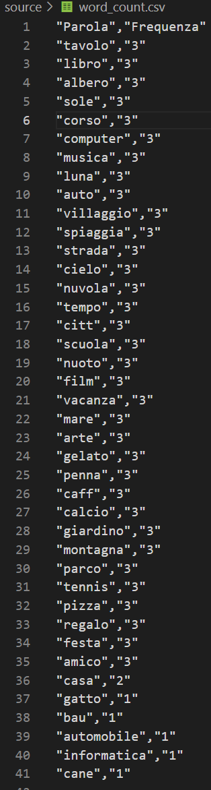
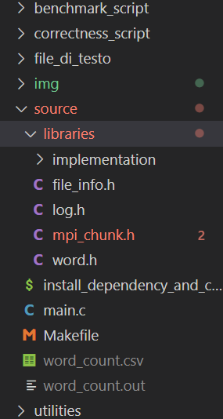
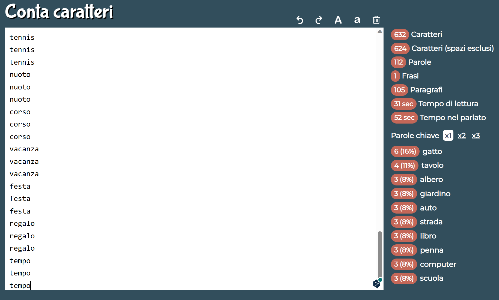
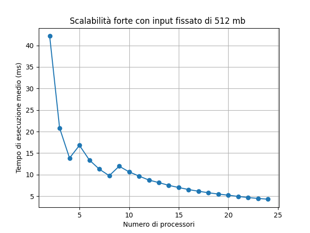
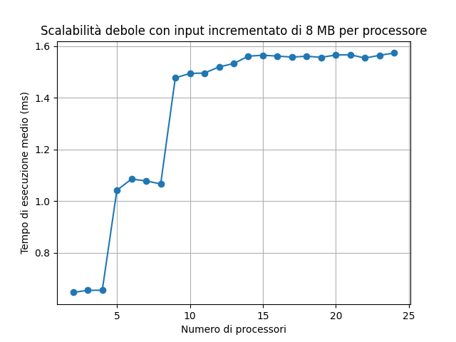

# MPI_Word_Count
>**MPI_Word_Count** è un'implementazione parallela di word count per il conteggio delle parole. Il word count viene utilizzato per diverse applicazioni come limiti di parole, analisi dei dati e indicizzazione dei documenti.

## Indice dei contenuti
1. [Descrizione del problema](#descrizione-del-problema)
2. [Soluzione proposta](#soluzione-proposta)
3. [Struttura del progetto](#struttura-del-progetto)
4. [Implementazione](#implementazione)
5. [Uso di MPI](#uso-di-mpi)
6. [Correttezza & Benchmark](#correttezza--benchmark) 
7. [Manuale d'uso](#manuale-duso)
8. [Considerazioni finali](#considerazioni-finali)


# Descrizione del problema
Il problema in questione può essere risolto prendendo spunto da map-reduce e riscrivendolo utilizzando MPI. 

Per eseguire velocemente il conteggio delle parole su un gran numero di file l'ideale è:

- Il **MASTER** deve leggere tutti i file all'interno di una directory. 
- Gli altri processi riceve la propria porzione sul totale di tutti i file inviata dal processo **MASTER**. 
- Ogni processo **SLAVE** che ha ricevuto la propria porzione dovrà effettuare su di essa un conteggio delle parole, per tenere traccia della frequenza di ogni parola trovata.
- Tutti i processi **SLAVE** salveranno una struttura formata da ["parola","frequenza"] in locale
- La parole elaborate cone le frequenze vengono inviate da ogni processo al **MASTER**, che dovrà effettuare un merge. 
- Infine, il **MASTER** produrrà un file CSV contenente le frequenze ordinate.

# Soluzione proposta
Per risolvere l'aspetto rigaurdante quello di dividere in maniera equa la computazione tra i processi,l'algoritmo opera come segue:

1. Il processo **MASTER** accetta una cartella come input da linea di comando, contenente i file su cui eseguire il conteggio delle parole. I file vengono suddivisi in modo equo, considerando la loro dimensione in byte, evitando di scorrerli per la divisione. Infine esso invia ad ogni processo riceve una o più partizioni di file da elaborare.
<br><br>Ogni partizione è formata da:
    - Un campo che **path** che contiene il path del file a cui è associata la partizione
    - Un campo **start_offset** indica il byte all'interno del file da cui la partizione inizia.
    - Il campo **end_offset** indica il byte all'interno del file in cui la partizione finisce.

> È possibile vedere un'implementanzione della struttura nel file [mpi_chunk.c](/source/libraries/mpi_chunk.h)

La somma delle dimensioni delle partizioni ricevute sarà uguale per ogni processo. 

2. I processi **SLAVE** ricevono la propria porzione di file e iniziano a conteggiare le parole, calcolandone la frequenza.

3. Le frequenze calcolate vengono inviate dagli **SLAVE** al **MASTER**.

4. Il **MASTER** riceve le frequenze da tutti gli altri processi e le combina. Infine, produce un file CSV contenente il conteggio preciso delle parole.

Questo è un esempio di file CSV di output:



## Struttura del progetto


- **img** contiene tutte le immagini per la documentazione.
- **source** contiene tutte i file .c, il makefile e uno script chiamato [install_dependency_and_compile.sh](./source/install_dependency_and_compile.sh) che scarica e installa tutte le dipendenze nel necessarie al funzionamento del codice ed effettua una make clean all per compilare il codice dando in output word_count.out
    - **libraries** contiene tutti gli header utilizzati per il progetto
        - **implementation** contiene tutte le implementazione degli header
- **file_di_testo** contiene parole di prova per provare il programma
- **benchmark_script** contiene due script per eseguire il benchmark per la weak e la strong scalability 
- **correctness_script** contiene uno script che verifica la correttezza del codice.
- **utilities** contiene uno script per la generazione di file di testo casuali utili per eseguire il benchmark di weak e strong scalability

## Input/Output del programma
### Input
Il programma prende in input, passato come argomento il path di una direcory contenente un serie di file di testo
### Output
Il programma fornisce in output un file CSV chiamato "word_count.csv" contenente una lista di parole e la frequenza (cioè il nunero di volte che sono state trovate all'interno dei vari file).

## Implementazione

### Possibili eccezioni 
Il programma verifica tre condizioni necessarie per proseguire e fornisce in base all'errore un "exit status" diverso per ogni errore:

- Se manca l'argormento al lancio del programma, quindi di fatto non è stato dichiarata la cartella di input viene restuito un **exit status corrispondente a 2**
- Se i processi che lanciano il programma sono <2 viene restuito un **exit status corrispondente a 3**
- Se la directory data come argomento non esiste realmente viene restituito un **exit status corrispondente a 4**

### Step 1: Come vengono divisi i file e salvati
I file presi in input vengono divisi dal MASTER in partizioni denominate Chunk. Con i file presi in input viene ricava dimensione in byte di ogni file utilizzando l'istruzione: 

```
File_info * get_file_info_from_path(char * path){

    struct stat sb;
    File_info * file = (File_info *) malloc(sizeof(File_info));

    if(stat(path, &sb) != -1){
        file->size = sb.st_size;
        file->path = malloc(sizeof(char) * strlen(path) + 1);
        strncpy(file->path ,path , strlen(path)+1);
    }

    return file;
    
}
```
>L'istruzione è presente nel file [file_info.c](source/libraries/implementation/file_info.c)

Dopodichè somma la dimensione di ogni file per ottenere la taglia totale dell'input da dividere tra i processi.

```
double partition_size = (int)  total_size / (numproc-1);
```

Ora il programma deve distribuire i file ai processi SLAVE. Per farlo divide il totale per ogni processo e se la taglia totale non è un multiplo deli numeri di SLAVE si assegnano i byte in "eccesso" all'ultimo processo. 

Dopo aver diviso i vari blocchi da assegnare ad ogni processo il MASTER scrive lo start offset, l'end offset e il path del file all'interno di una struct:

```
typedef struct Chunk{
    double start_offset;
    double end_offset;
    char path[300];
} Chunk;
```
>L'istruzione è presente nel file [mpi_chunk.h](source/libraries/mpi_chunk.h)

Una volta calcolati li carica in un array "`chunks_array`" 
### Step 2: Come vengono inviati i chunk creati
Ebbene notare che il processo MASTER per non perdere tempo non calcola i chunk e poi li invia ma li invia non appena un chunk viene prodotto ai processi SLAVE in ordine di rank.

Per non rimanere in attesa l'invio dei chunk avviene in maniera asincrona con la funzione MPI_Isend. In questo modo il MASTER può continuare il calcolo dei chunk per i restanti processi senza fermarsi.

```
MPI_Isend(chunks_array[task_to_assign - 1], chunk_count, chunktype, task_to_assign, COMM_TAG, MPI_COMM_WORLD, &(requests[task_to_assign-1]));
```

**La documentazione raccomanda** di non modificare il buffer inviato finchè non si è sicuri che l'operazione di invio sia stata completata, per tale motivo, ogni **SLAVE** viene allocato un apposito buffer.

Una volta inviati i chunk, il **MASTER** attende che tutte le operazioni di invio siano completate utilizzando MPI_Waitall. 
```
MPI_Waitall(numtasks - 1, reqs , MPI_STATUSES_IGNORE);
```

Infine dealloca tutti buffe che sono stati allocatri dinamicamente.

```
 for(int i = 0; i< numproc -1; i++){
            MPI_Free_mem(chunks_array[i]);
        }
MPI_Free_mem(chunks_array);
free_files_info(files, file_nums);
```
`free_files_info` è una funzione che svuota la lista di file

```
void free_files_info(GList * list, int num){

    GList * elem = list;
    for(int i=0; i<num; i++){
            File_info * f = elem->data;
            #ifdef DEBUG
                printf("File che viene cancellato:\n");
                print_file_info(f);
            #endif
            free(f->path);
            free(elem->data);
            elem = elem->next;
    }
    g_list_free(list);
}
```
>L'istruzione è presente nel file [file_info.c](source/libraries/implementation/file_info.c)

### Step 4 : Recezione dei Chunk dai processi SLAVE

In questa fase il MASTER ha inviato un array di chunk ad ogni SLAVE per effettuare il conteggio.

Il processo SLAVE non conosce la dimensione del buffer pertanto bisogna ricavarla (altrimenti o si rischia buffer overflow o sprechi di memoria).
Per allocare con precisione, ogni processo SLAVE deve:

1. Controllare le informazioni del messaggio in arrivo utilizzando MPI_Probe la quale è una funzione bloccante.
2. Dopdodichè si ricava da MPI_Status (riempito dalla Probe) si ricava la dimensione del buffer utilizzando MPI_Get_count dando come input MPI_Status  e l'MPI_Datatype 
3. Una volta ottenuta la dimensione può allocare con una semplica malloc l'array di struct di File_chunk
4. Infine per ricevere i dati all'interno del messaggio utilizza MPI_Recv dando come input l'array appena creato

```
MPI_Probe(MASTER_RANK, COMM_TAG, MPI_COMM_WORLD, &Stat);  

MPI_Get_count(&Stat, chunktype, &chunk_number); 

MPI_Alloc_mem(sizeof(Chunk ) * (chunk_number), MPI_INFO_NULL , &chunk_to_recv);

MPI_Recv(chunk_to_recv, chunk_number, chunktype, MASTER_RANK, COMM_TAG, MPI_COMM_WORLD, &Stat); 
```

### Step 5: Conteggio delle parole all'intero del Chunk

Una volta ottenuti i chunk, ogni processo conta unicamente le parole che si trovano all'interna della porzione di file assegnatagli.

Ma siccome i chunk sono calcolati sulla base delle dimensione è possibile che una parola venga spezza in due chunk durante la divisione.

| Chunk 1 | Chunk 2                |
|-------|-----------------------|
|Pane Pasta tonno      | ...lo vino uva                |
|  ....................     | ....................               |
|cippola grappo..       | parola                |

In questo esempio la parola "grappolo" si trova tra due chunk, pertano, per risolvere tale problema evitando al tempo stesso comunicazioni tra processi superflue, ogni processo è libero di andare oltre la fine del proprio chunk per completare la lettura della parola.

Riprendendo l'esempio il processo 1 continua a leggere la parola "grappolo" leggendo nel secondo chunk lavorando così su un pezzo del chunk destinato al processo 2. Il processo 2 nel mentre sbircia sul chunk 1 per capire se "lo" è parte di una parola presente nell'altro chunk e nel caso non la calcola.

```
Word_occurrence * get_word_list_from_chunk(Chunk *chunks_received, int chunk_number, int rank, int * num_word){

    FILE *file_to_read;
    
    char word[45];
    int n = 0, lex_num = 0;
    int num_occ = 0;

    Chunk chunk;
    char ch;
    GHashTable* hash = g_hash_table_new(g_str_hash, g_str_equal);
    Word_occurrence * occurrences;

    int flag_word_not_terminate= 0;

    for(int i = 0; i < chunk_number; i++){

        chunk = chunks_received[i];
        file_to_read = fopen(chunk.path , "r");
        fseek(file_to_read, chunk.start_offset , SEEK_CUR);

        if(ftell(file_to_read) != 0){ 
            fseek(file_to_read,  -1 , SEEK_CUR);
            do{
                ch = fgetc(file_to_read);
            }while(!check_if_end_char(ch));
        }
        
        int state = 0;  

        while (ftell(file_to_read) < (chunk.end_offset)  || flag_word_not_terminate)
        {
            word[n] = fgetc(file_to_read);
            switch (state)
            {
                case 0: 
                    if(isalpha(word[n]) || isdigit(word[n])){
                        state = 1;
                        n++;
                        flag_word_not_terminate = 1;   
                    }
                break; 
                case 1: 
                    if(isalpha(word[n]) || isdigit(word[n])){
                        state = 1;
                        n++ ; 
                        flag_word_not_terminate = 1; 
                    }
                    else{
                        if(check_if_end_char(word[n])){
                            word[n] = '\0';
                            for(int j = 0; word[j]; j++){
                                word[j] = tolower(word[j]);
                            }
                            count_word(hash , strdup(word), &lex_num);
                            n = 0;
                            state = 0;
                            flag_word_not_terminate = 0;
                        }  
                    }
                break;
            }
        }
    }
    
    occurrences = create_inf_to_send(hash, &num_occ);
    * num_word = lex_num; 

    return occurrences;
}
```
>L'istruzione è presente nel file [wordlist.c](source/libraries/implementation/wordlist.c)

Le parole vengono contate usando hashtable che utilizza come chiave la parola e come valore il conteggio della parola. 

Si è scelto di usare questo tipo di struttura dati perchè la lookup ha complessità temporale O(1).

```
void count_word(GHashTable* hash, char * word, int * word_counter){

    gpointer lookup;
    int val;
    lookup = g_hash_table_lookup(hash,word);
    if(lookup == NULL){
        val = 1;
        (*word_counter)++;
    }
    else{
        val = GPOINTER_TO_INT(lookup) + 1;
    }
    g_hash_table_insert(hash,word,GINT_TO_POINTER (val));
}
```
>L'istruzione è presente nel file [wordlist.c](source/libraries/implementation/wordlist.c)

### Step 6: Invio delle parola trovate con le relative frequenze
Una volta trovate tutte le parolae i processi SLAVE a partire dall'hashtable citata precedentemente crea un array di struct di tipo Word
Ogni processo a partire dalla propria hashtable locale crea un array di struct Word_Occurrence che è formata in questo modo:
```
typedef struct Word_occurrence{

    int number_repeats;
    char word[MAXSTRING];

} Word_occurrence;
```
>L'istruzione è presente nel file [word.h](source/libraries/word.h)

La struttura contiene:
- Il numero di occorrenze trovate 
- La parola associata a quelle occorrenze

L'array di struct Word_Occurrence earray viene inviato al MASTER tramite la funzione MPI_Send.

```
MPI_Send(occurrences, num_occ, wordtype, 0, COMM_TAG, MPI_COMM_WORLD);
```

In questo caso è conveniente usare Send, perchè è l'ultima operazione che eseguono i processi SLAVE prima di terminare

### Step 7: Recezione delle parola trovate con le relative frequenze

Il MASTER, che nel frattempo è rimasto in attesa che gli SLAVE terminassero il lavoro, come citato nello [Step 2](#step-2-come-vengono-inviati-i-chunk-creati). Appena esce dalla wait all utilizzando MPI_Probe con la costante MPI_ANY_SOURCE si mette in attesa di un messaggio in arrivo senza riceverlo (Ricordiamo che MPI_Probe è bloccante).
Una volta ricevuto con MPI_Get_count ottiene la dimensione dell'array di Word_Occurrence e lo alloca usando malloc.
Ora può finalmente ricevere il messaggio in arrivo utilizzando MPI_Recv che non è altro che l'array di Word_Occurence

```
 for(int i = 0; i < numproc -1; i++){
            MPI_Probe(MPI_ANY_SOURCE, COMM_TAG, MPI_COMM_WORLD, &stat);
            MPI_Get_count(&stat, wordtype, &words_in_message);
            MPI_Alloc_mem(sizeof(Word_occurrence ) * words_in_message, MPI_INFO_NULL , &occurrences);
            MPI_Recv(occurrences, words_in_message, wordtype, stat.MPI_SOURCE, COMM_TAG, MPI_COMM_WORLD, &stat);
            for(int j=0; j< words_in_message; j++){
                lookup = g_hash_table_lookup(hash,occurrences[j].word);
                if(lookup == NULL){
                    g_hash_table_insert(hash,occurrences[j].word,GINT_TO_POINTER (occurrences[j].number_repeats));
                }
                else{
                    g_hash_table_insert(hash,occurrences[j].word,GINT_TO_POINTER (occurrences[j].number_repeats + GPOINTER_TO_INT(lookup)));
                }
            } 
        }
``` 
L'unione delle varie coppie <parola,frequenza> vine fatta in ordine di arrivo (ad esempio se il processo 6 ha terminato prima del processo 1 allora 6 sarà processato priama di 1).
Il merge come per gli SLAVE avviene usando un hashtable in cui ogni array di Word_Occurrence viene caricato all'interno dell'hashtable usando come chiave la parola e come valore la frequenza.

### Step 8: Creazione del file CSV
Infine il MASTER generare il file CSV estrando le parole dall'hashtable con le relative frequenze e scrivendole su ogni riga nel formato "parola,frequenza" dando in output il file `word_count.csv`

# Uso di MPI
Questa sezione si sofferma su alcuni dettagli tecnici emersi in fase di implementzione che, oltre alle funzioni descritte nella sezione precedente, sono servite per agevolare il trasferimento delle frequenze elaborate da SLAVE a MASTER e dei chunk da MASTER a SLAVE.

## Creazione di datatype struct

Al fine di trasmettere array di struct, è stato richiesto di creare un tipo di dato dedicato per le strutture "Word_occurrence" e "File_chunk". Per raggiungere questo obiettivo, è stata utilizzata la funzione MPI_Type_create_struct. Di seguito è visibile la funzione usata per la creazione della struct del chunk:

```
void create_chunk_datatype(MPI_Datatype *chunktype){

    MPI_Datatype oldtypes[2];
    int blockcounts[2];

    MPI_Aint    offsets[2], lb, extent;

    offsets[0] = 0;
    oldtypes[0] = MPI_DOUBLE;
    blockcounts[0] = 2;

    MPI_Type_get_extent(MPI_DOUBLE, &lb, &extent);
    offsets[1] = 2 * extent;
    oldtypes[1] = MPI_CHAR;
    blockcounts[1] = 260;

    MPI_Type_create_struct(2, blockcounts, offsets, oldtypes, chunktype);
    MPI_Type_commit(chunktype);

}
```
>L'istruzione è presente nel file [mpi_chunk.c](source/libraries/implementation/mpi_chunk.c)

Qui invece è visibile la funzione usata per la creazione della struct per Word_Occurrence :
```
void create_word_datatype(MPI_Datatype *wordtype){
    MPI_Datatype oldtypes[2];
    int blockcounts[2];
    MPI_Aint    offsets[2], lb, extent;
    offsets[0] = 0;
    oldtypes[0] = MPI_INT;
    blockcounts[0] = 1;
    MPI_Type_get_extent(MPI_INT, &lb, &extent);
    offsets[1] = 1 * extent;
    oldtypes[1] = MPI_CHAR;
    blockcounts[1] = MAXSTRING;
    MPI_Type_create_struct(2, blockcounts, offsets, oldtypes, wordtype);
    MPI_Type_commit(wordtype);
}
```
>L'istruzione è presente nel file [word.c](source/libraries/implementation/word.c)


## MPI_Alloc_mem

Si è deciso di usare la funzione MPI_Alloc_mem per allocare dinamicamente la memoria poichè secondo la documentanzione migliora di molto l'esecuzione. Infattii, la documentazione afferma che: 

>"In some systems, message-passing and remote-memory-access (RMA) operations run faster when accessing specially allocated memory"<br><br>_Fonte:_ https://www.mpi-forum.org/docs/mpi-2.0/mpi-20-html/node54.htm

# Correttezza & Benchmark 

## Correttezza 

La correttezza è stata provata in due modi:

1. Empiricamente, fornendo in input cartelle contenente file di piccoli dimensioni controllabili manualmente 
2. In modo automatizzato, utilizzando siti di word counter come ad esempio https://contacaratteri.it/

    

3. Infine è stato verificato che all'aumentare di processori utilizzati il programma non avvesse comportamenteni in attesa. Per lo scopo è stato script uno script automatico chiamato [correctness.sh](correctness_script/correctness.sh) che genera un oracolo con 2 processi e successivamente esegue il programma incrementando i processi di 5 in 5 fino a 60 verificando che ad ogni iterazione che l'output non cambi.

## Benchmark

I test di scalablità sono stati eseguiti su un cluster su Google Cloud formato da 3 macchine di tipo `e2-standard-8` con ***8 vCPU e 32GB di RAM***.

Tutti i file citati nelle prossime sezioni sono stati generati inserendo parole in modo casuale e in modo automatizzato con lo script [word_generator_script.sh](utilities/word_generator_script.sh)

###  Scalabilità forte

Per ottenere dei dati si è pensato di generare un file di prova di dimensioni di 512 MB e testarlo con un numero crescente di processori per ogni esecuzioni.

Tutto il processo è stato automatizzato usando una versione modificata (per adattarla al calcolo su cluster) dello script [benchmark_strong_scalabilty.sh](benchmark_script/benchmark_strong_scalabilty.sh)

I dati riportati in tabella mostrano la media di 3 esecuzioni consecutive

Per ricavare i seguenti dati, si è fissato un input di 503Mb e utilizzato un numero crescente di processori ad ogni esecuzione. Per essere più precisi, i dati riportati fanno riferimento ad una media di tre esecuzioni per ogni variazione del numero di processori.

| Numero di processori | Numero di worker | Tempo medio (ms) | Speedup |
|----------------------|------------------|------------------|---------|
| 2                    | 1                | 42.17            | 1.00    |
| 3                    | 2                | 20.82            | 2.03    |
| 4                    | 3                | 13.84            | 3.05    |
| 5                    | 4                | 16.79            | 2.51    |
| 6                    | 5                | 13.38            | 3.15    |
| 7                    | 6                | 11.26            | 3.74    |
| 8                    | 7                | 9.74             | 4.33    |
| 9                    | 8                | 11.95            | 3.53    |
| 10                   | 9                | 10.63            | 3.97    |
| 11                   | 10               | 9.66             | 4.37    |
| 12                   | 11               | 8.73             | 4.83    |
| 13                   | 12               | 8.14             | 5.18    |
| 14                   | 13               | 7.49             | 5.63    |
| 15                   | 14               | 7.00             | 6.03    |
| 16                   | 15               | 6.52             | 6.47    |
| 17                   | 16               | 6.13             | 6.88    |
| 18                   | 17               | 5.78             | 7.29    |
| 19                   | 18               | 5.47             | 7.71    |
| 20                   | 19               | 5.22             | 8.08    |
| 21                   | 20               | 4.92             | 8.57    |
| 22                   | 21               | 4.67             | 9.03    |
| 23                   | 22               | 4.47             | 9.44    |
| 24                   | 23               | 4.28             | 9.85    |



###  Scalabilità debole

Per ricavare i seguenti dati si è deciso che all'aggiunta di ogni processore la taglia dell'input sarebbe cresciuta di 16 Mb. Anche in questo caso i dati riportati fanno riferimento ad una media di tre esecuzioni per ogni variazione del numero di processori. 

Per ottenere dei dati si è pensato di generare dei file di prova di dimensioni che crescessero di 8 MB rispetto al numero di processoeri e registrare i tempi per ogni esecuzioni.

Tutto il processo è stato automatizzato usando una versione modificata (per adattarla al calcolo su cluster) dello script [benchmark_weak_scalabilty.sh](benchmark_script/benchmark_weak_scalabilty.sh)

I dati riportati in tabella mostrano la media di 3 esecuzioni consecutive

Per ricavare i seguenti dati, si è fissato un input di 503Mb e utilizzato un numero crescente di processori ad ogni esecuzione. Per essere più precisi, i dati riportati fanno riferimento ad una media di tre esecuzioni per ogni variazione del numero di processori.

| Numero di processori | Numero di worker | Tempo medio (ms) | Dimensione del file (in MB) |
|----------------------|------------------|------------------|-----------------------------|
| 2                    | 1                | 0.65             | 8                           |
| 3                    | 2                | 0.65             | 16                          |
| 4                    | 3                | 0.66             | 24                          |
| 5                    | 4                | 1.04             | 32                          |
| 6                    | 5                | 1.09             | 40                          |
| 7                    | 6                | 1.08             | 48                          |
| 8                    | 7                | 1.07             | 56                          |
| 9                    | 8                | 1.48             | 64                          |
| 10                   | 9                | 1.49             | 72                          |
| 11                   | 10               | 1.50             | 80                          |
| 12                   | 11               | 1.52             | 88                          |
| 13                   | 12               | 1.53             | 96                          |
| 14                   | 13               | 1.56             | 104                         |
| 15                   | 14               | 1.56             | 112                         |
| 16                   | 15               | 1.56             | 120                         |
| 17                   | 16               | 1.56             | 128                         |
| 18                   | 17               | 1.56             | 136                         |
| 19                   | 18               | 1.56             | 144                         |
| 20                   | 19               | 1.57             | 152                         |
| 21                   | 20               | 1.57             | 160                         |
| 22                   | 21               | 1.55             | 168                         |
| 23                   | 22               | 1.56             | 176                         |
| 24                   | 23               | 1.57             | 184                         |




# Manuale d'uso

## Premessa
Tutti gli script citati sono stati pensati per essere eseguiti sul seguente docker [spagnuolocarmine/docker-mpi](https://hub.docker.com/r/spagnuolocarmine/docker-mpi)

Il quale è comodamente lanciabile (É richiesto che docker sia installato) lanciando il comando

```docker run -it --mount src="$(pwd)",target=/home,type=bind spagnuolocarmine/docker-mpi:latest```

## Compilazione e installazione dipendenze necessarie

Per poter compilare installando anche le dipendenze necessarie in modo automatico è disponibile nella repo sotto la cartella _source_ lo script [install_dependency_and_compile.sh](source/install_dependency_and_compile.sh)

Al termine dell'esecuzione di questo script, verrà installata la libreria `libglib2.0`  che implementa tutte le strutture dati utilizzate all'interno del progetto, inoltre, verrà generato il compilato `word_count.out` richiamabile con mpirun.

## Esecuzione locale

Per comodità è stato predisposto uno script che esegue automaticamente compilazione, installazione e esecuzione con stampa del file generato direttamente nella repo. Lo script si chiama [run.sh](run.sh).

Evenetualmente si volesse eseguire manualmente il programma è necessario seguire prima la sezione precedente e, successivamente lanciare stando nella cartella _source_ il seguente comando:

```
mpirun -np NUMERO_DI_PROCESSORI word_count.out DIRECTORY
```

Dove:

- NUMERO_DI_PROCESSORI : Il numero di processori che MPI utilizzerà per l'esecuzione.

- DIRECTORY : La directory contenente tutti i file sui quali effettuare il conteggio delle parole.

## Esecuzione remota

Dopo aver eseguito la sezione [Compilazione e installazione dipendenze necessarie](#compilazione-e-installazione-dipendenze-necessarie), il seguente comando permette l'esecuzione remota:

mpirun -np NUMERO_DI_PROCESSORI --hostfile HOSTFILE word_count.out DIRECTORY

Dove:

- NUMERO_DI_PROCESSORI: Il numero di processori che MPI utilizzerà per l'esecuzione.

- HOSTFILE: File all'interno del quale è specificato, per ogni macchina, l'indirizzo IP ed il numero di slots.

- DIRECTORY: La directory contenente tutti i file sui quali effettuare il conteggio delle parole. Questo parametro non può essere omesso.

Qui di seguito è mostrato un esempio di HOSTFILE:

```
# This is an example hostfile.  Comments begin with #
#
# The following node is a single processor machine:
foo.example.com
 
# The following node is a dual-processor machine:
bar.example.com slots=2
 
# The following node is a quad-processor machine, and we absolutely
# want to disallow over-subscribing it:
yow.example.com slots=4 max-slots=4
```
>Fonte: https://github.com/spagnuolocarmine/ubuntu-openmpi-openmp

# Considerazioni finali

Nel capitolo dedicato al [benchmark](#benchmark), vengono riportati i dati riguardanti le prestazioni dell'applicativo.

L'analisi degli speedup calcolati e presentati nella tabella rivela che:

>Lo speedup risente negativamente della mancanza di lavoro svolto dal MASTER su qualsiasi porzione dei file. 

Ad esempio, con 3 processi, ossia 2 worker e il master, lo speedup ideale dovrebbe essere 3, ma risulta essere solo 2.03.

>Analizzando il grafico della scalabilità forte, emerge un miglioramento dei tempi di esecuzione all'aumentare del numero di processi impiegati. 

Si osserva in particolare che dall'ottavo processore momento in cui è staro necesario anche CPU degl'altri due cluster le prestazioni sono leggermente diminiute proprio a causa dell'overhead delle comunicazioni

È bene notare anche che a partire dal 14esimo processore fino al 23esimo, le prestazioni rimangono costanti o tendono addirittura a peggiorare. Ciò è causato dall'aumento dei processori che comporta una maggiore suddivisione dei file in porzioni più piccole che porta ad un overhead delle comunicazioni tra i processori diventa significativo in termini di calo delle prestazioni.
